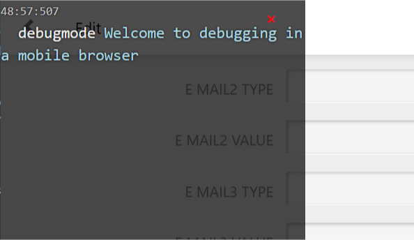
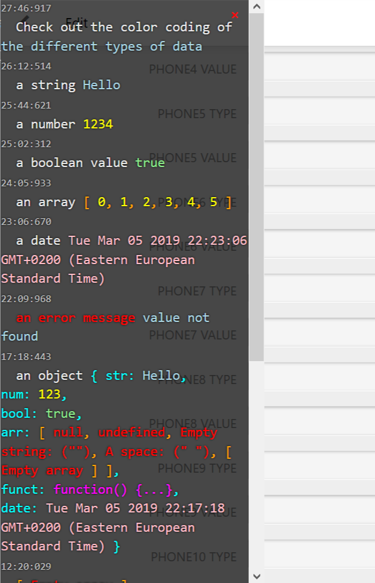

# debugmode
Ever been frustrated by the fact that you can't debug your website, or mobile web app on an actual mobile 
browser because it lacks a console? DUN DA DA DA DUN!! Enter *debugmode*, a console like overlay for 
testing JavaScript code in browsers that do not support console.log, i.e. mobile browsers.



## Basic functionality
Debugmode inserts a semi-transparent div overlay covering a portion of your webpage (at z-index: 1099), 
inserts some CSS styles into your CSS stylesheet and then logs and displays events in sylized HTML. 
Logs are displayed in reverse order with the most recent events showing at the top (where you don't have 
to scroll to find them). CSS styles are applied to inspected items to clearly show and differentiate 
between types of data, such as Array, String, Object, Function, etc. Clicking on the overlay will move 
it out of your way to the other side of the screen. Events can be held in a cache until debugmode is 
displayed. Each event is displayed with a timestamp.

## Getting Started
There are multiple ways that you can include debugmode in your project. Use one of the following:

### The Script Tag Method
By far, the simplest method is to drop the debugmode.js, or debugmode.min.js file into your scripts folder, add a script tag to your html 
file to load it into your project and start debugging.

```HTML 
<!--index.html-->
<script type="text/javascript" src="[path/to/scripts]/debugmode.min.js"></script>
```
Access functions via the namespace `APP`, i.e. `APP.debug`.

### The Module Import Method
If you are using modules, see the [/modules folder](./modules/README.md), for details on importing and using debugmode as a module.

## The functions
The `APP` namespace contains 4 functions:

#### `APP.setDebugMode` and `APP.debug`

```javascript
//main.js

APP.setDebugMode(true); //set to true to use the debugger during development
APP.debug(whatsThis, "This is where you put a description of the item you are inspecting", true);

var debug = APP.debug; // recommended shortform access to APP.debug
```

Unlike `console.log`, you can't pass an unlimited number of arguments to `APP.debug`, but it does accept 
up to 3. The first can be anything such as a string, number, object, array, function, date object, 
etc. The second accepts a string, which is used for a description. And the 3rd is to indicate that 
this is an error state. Alternately, the word 'error' anywhere in the description will mark the item 
as an error. (More on errors later)

#### `APP.setDebugToConsole`
Debugmode integrates with the console when you want it to by calling

```javascript
APP.setDebugToConsole(true); //false to quit logging to the console
```

This is in addition to printing to the screen. You can log only to the console if you like by setting `APP.setDebugMode(false)` and `APP.setDebugToConsole(true)`.

#### `APP.cacheMsg`
Don't like the debugmode overlay popping up over your app all the time when you aren't using it, 
but still want to log events in the background to access them if needed? You can cache logged items 
using `APP.cacheMsg`, and then set debugMode to true at a later time to spit out the entire log.

```javascript
APP.cacheMsg(whatsThis,"description", false); //accepts the same arguments as APP.debug
```

This can be used in one of 2 ways:

1. cache events as they happen when everything is running smoothly, but if an error is thrown, activate debugmode, showing you the whole log
1. include some form of control, like a button to change debugMode to true, displaying the entire log. (I like to hide it even better by creating a secret code word in a search field or login form that toggles debugMode)

Note: this cache can get very big very quickly slowing down the performace of your app or website, 
so be careful how many things you decide to cache.

## Formatting
To help quickly differentiate data types, a colour coding scheme has been implemented.

Item|Text Colour
----|----
Description|White
Strings|Light Blue
Numbers|Yellow
Booleans|Light Green
Arrays|Orange
Objects|White
Functions|Magenta
Dates|Pink
Errors|Red
Big Integers|Lime Green
Symbols|Hot Pink
RegExp|Cyan



## Errors
Marking an item as an error, or just including the word "error" in the description will mark the item 
in red, helping you to notice and locate errors more quickly. Empty strings ("\") will be clearly 
printed out in red *Empty String ("\")*, and the values *`null`* and *`undefined`* will show up in red as 
well to differentiate them from the string values "null" and "undefined".

## Limitations
Strings passed to debugmode will be truncated at 5000 charactors, and objects at 50 key:value pairs. Only 
250 events will be logged per second, afterwhich you will get:

*--TOO MANY MESSAGES LOGGED--*

The counter will reset after 5 seconds.

These limitations are safety limits set in place so you don't kill your browser (too often!). Despite 
these limits, you should avoid burying a call to `APP.debug` too deep in a 'for', or 'while' loop 
(though debugging the loop sometimes neccessitates it, hence the safety limits). Besides making it more 
difficult to find the actual information that you are looking for, logging too many events will 
significantly slow down a web browser.